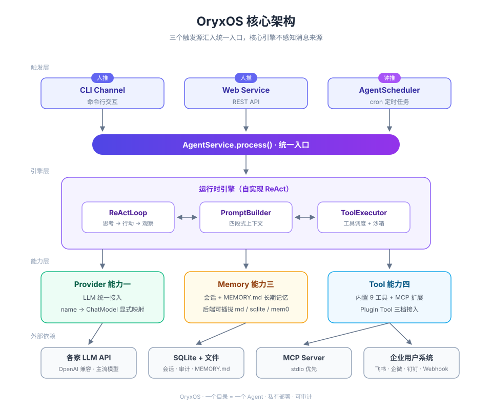

<p align="center">
  
</p>

<p align="center"><b>企业级 Agent Harness OS · Java 原生 · 私有部署 · 可审计</b></p>

<p align="center">
   
</p>

<p align="center"><a href="https://lemonkz.github.io/enterprise-oryxos/">官方网站 / Website</a></p>

OryxOS 是基于 Java 实现的企业级 Agent Harness OS（Agent 操作系统）：装在企业自己的 K8s、虚拟机或物理机上，作为统一底座运行各种业务 Agent——运维助手、客服助手、HR 助手、销售助手、知识管理助手——共享同一套渠道接入、模型路由、记忆系统、工具调用、沙箱执行与审计能力。数据完全留在企业自己的基础设施，不锁任何云生态。

```
AGENT.md 目录 + Memory + Tool + MCP + Skill = 一个 Agent
```

一个目录定义一个 Agent，一个底座运行一群 Agent。业务方不需要写 Agent 后端代码。

## 为什么需要 OryxOS

每家公司都有该交给 Agent 的活，但 Agent 大多停在 demo，卡在四道门槛：

| 门槛 | OryxOS 的回答 |
|------|--------------|
| 定义一个 Agent 要写代码 | **一个目录 = 一个 Agent**：写一份 `AGENT.md`（frontmatter 运行配置 + 正文任务指令）即上线 |
| 云平台要把数据拿走 | **私有部署**：数据不出企业，SQLite + 本地文件，不绑任何云 |
| 执行是黑盒 | **全链路审计 + 沙箱**：`tool_invocations` / `llm_calls` day one 落库，工具调用过白名单沙箱 |
| 跑一个容易、跑一群难 | **OS 级治理**：多 Agent 并存、定时调度、统一渠道与 Provider 路由 |

业界已有开源 Agent OS 验证了这个品类（OpenClaw 用 Node.js、Hermes Agent 用 Python），但 Java 生态在这一层是空白。Java 是企业后端的事实标准，OryxOS 补上这个位置——让 Java 体系的企业像部署一个 Spring Boot 应用一样部署自己的 Agent 底座。

## 核心架构



- **三个触发源汇同一入口**：CLI / REST API（人推）与 `AgentScheduler` 定时任务（钟推）走同一条 `AgentService` 链路，ReAct 循环不感知消息来源
- **单 JAR 单进程**：所有能力收敛到一个引擎、一套存储、一个进程，符合"装好就跑"的定位

## 五大核心能力

| 能力 | 说明 |
|------|------|
| **对接 LLM** | Provider 抽象统一对接 DeepSeek、通义、Kimi、智谱、OpenAI、Anthropic 等主流模型及本地推理（Ollama/vLLM），provider name → ChatModel 显式映射，运行时切换无锁定 |
| **ReAct 循环** | Agent 的推理引擎，自己实现不套外部框架：LLM 思考 → 调工具 → 看结果 → 再决策，直到给出最终响应或达到最大迭代次数（默认 10） |
| **Memory 记忆** | 会话记忆 + 长期记忆（`MEMORY.md`），Agent 通过 `save_memory` / `recall_memory` 主动读写，跨对话记住用户偏好与项目背景；后端可插拔（Markdown / SQLite / Mem0） |
| **Tool 工具** | 内置 9 个工具（文件、Shell、HTTP、记忆、通知），Plugin Tool 三档接入：零代码 Agent 目录 + MCP（主推）→ 轻代码自写 MCP server → 重代码 `@Tool` Java Bean |
| **Web Service** | 完整 REST API 对外暴露所有能力（会话管理、Agent 调用、Profile/Memory/Tool 查询、健康检查），任何语言都能 HTTP 接入 |

## 核心特性

- 🤖 **一个目录 = 一个 Agent**：`AGENT.md` frontmatter 是运行配置，正文是任务指令，多个 Agent 同实例并存
- 🧠 **自实现 ReAct**：核心循环自己写，Spring AI 只用一半（Provider 抽象 + schema 生成），禁用自动 tool 执行，调度完全可控
- 🛡️ **安全 day one**：`Sandbox` 接口 + `WhitelistSandbox` 白名单（文件路径 / Shell 命令 / HTTP 域名），全链路审计落库，凭证走环境变量不落地
- 🔌 **开放标准**：工具用 MCP，Skill 借 Anthropic Agent Skills 形态，渐进式披露不撑爆上下文
- ⏰ **定时任务**：`AGENT.md` 声明 cron，到点自动跑（钟推），状态与执行历史落 SQLite 重启不丢
- 📨 **出站通知**：`notify_channels` 全局注册表，Agent 自然语言按名引用，推送到企业微信 / 飞书 / 钉钉群机器人 webhook
- ☕ **Java 原生**：JDK 21 + virtual thread，复用企业现有 Java 运维工具链（Nacos / Prometheus / SkyWalking…）

## 快速开始

### 环境要求

- JDK 21+
- Maven 3.8+
- 一个 LLM API Key（DeepSeek / Kimi / OpenAI 兼容协议均可）

### 编译打包

```bash
git clone https://github.com/oryx-labs/oryxos.git
cd oryxos
mvn clean package
```

### 初始化工作区并对话

```bash
# 初始化 .oryxos/ 工作区（幂等，不覆盖已有文件）
java -jar oryxos-boot/target/*.jar init

# 配置 API Key（环境变量注入，不明文写死）
export DEEPSEEK_API_KEY=sk-xxx

# CLI 交互对话
java -jar oryxos-boot/target/*.jar chat --profile weather
```

### 启动 REST API 服务

```bash
java -jar oryxos-boot/target/*.jar serve    # 默认 8080 端口
```

```bash
# 创建会话
curl -X POST http://localhost:8080/api/v1/sessions

# 发消息（同步返回最终响应）
curl -X POST http://localhost:8080/api/v1/sessions/{id}/messages \
  -H "Content-Type: application/json" \
  -d '{"content":"查一下北京天气并告诉我穿什么"}'

# 无状态调用一个 Agent
curl -X POST http://localhost:8080/api/v1/agents/weather/invoke \
  -H "Content-Type: application/json" \
  -d '{"message":"上海今天适合穿什么"}'
```

### 定义一个 Agent（零代码）

```bash
oryxos profile create daily-weather
```

编辑 `.oryxos/agents/daily-weather/AGENT.md`：

```markdown
---
name: daily-weather
description: 每天早上查天气并推送穿搭建议
provider:
  name: deepseek
  model: deepseek-chat
tools:
  - http_get
  - notify
schedules:
  - key: morning
    cron: "0 0 8 * * *"
    message: 查一下北京今天的天气，生成穿搭建议并推送到团队群
---

你是每日天气助手。每天按要求查询天气，给出简短的穿搭建议，
然后用 notify 工具把结果发到 team-lark 渠道。
```

重启或等下一轮加载，这个 Agent 就会每天早上 8 点自动运行——全程零代码。

## 项目结构

```
oryxos/
├── oryxos-core             核心抽象：OryxTool、Session、Profile、ReActLoop、
│                           PromptBuilder、ToolExecutor、AgentService、AgentScheduler
├── oryxos-persona          人格库（copy-in 模板）
├── oryxos-provider         Provider 抽象（provider name → ChatModel 显式映射）
├── oryxos-memory           MemoryService 门面、LongTermMemory、MemoryTools
├── oryxos-knowledge        知识库：本地后端、检索流水线、KnowledgeTools
├── oryxos-tool             内置 Tool、MCP Client、ToolRegistry、Sandbox、Notify
├── oryxos-channel-cli      CLI Channel
├── oryxos-channel-feishu   飞书入站渠道（长连接）
├── oryxos-channel-wecom    企微入站渠道
├── oryxos-channel-dingtalk 钉钉入站渠道
├── oryxos-web              Web Service：REST API、GlobalExceptionHandler、OpenAPI
├── oryxos-storage          SQLite 持久化、审计 Repository
├── oryxos-cli              Picocli 命令行入口
├── oryxos-boot             Spring Boot 启动模块
└── docs/                   项目文档
```

## 文档

| 文档 | 内容 |
|------|------|
| [官方网站](https://lemonkz.github.io/enterprise-oryxos/) | 产品官网与在线文档（中/英） |
| [业界调研](docs/IndustryResearch.md) | Agent OS 定义、业界格局、Java 生态缺位、OryxOS 定位 |
| [需求文档](docs/DemandAnalysis.md) | 五大核心能力、验收标准、数据模型 |
| [技术方案](docs/TechnicalSolution.md) | 技术选型、模块结构、关键设计（最权威） |
| [AI 编程指南](docs/AiProgrammingGuide.md) | Spec-Kit 开发拆解与工作流 |

## 路线图

开发理念：**慢就是快，克制且聚焦**。先把单机运行时内核做扎实，再逐步生长分布式能力。

- **阶段一（当前）单机运行时内核** — 五大核心能力跑通，单节点运行和管理一群 Agent
- **阶段二（规划）底座分布式** — 实例无状态化、状态外置、多副本部署，支撑更大规模与高可用
- **阶段三（愿景）跨节点 Agent 协作** — Agent 通信底座，多节点 Agent 发现、委托、可靠异步协同
- **横向能力** — 多租户、SSO、完整审计、Tool Policy、可观测、Web 管理台，伴随各阶段逐步补齐

长期目标：走进 Apache 基金会，成为 Apache 顶级项目。

## 贡献

- 欢迎 issue / PR；找 `good-first-issue` 标签上手
- 提 PR 前请确保 `mvn clean package` 通过，新增功能附测试
- 遵守项目技术约定：见 [技术方案](docs/TechnicalSolution.md) 与 [CLAUDE.md](CLAUDE.md)

## 许可证

[Apache License 2.0](LICENSE)

## 社区

OryxOS 由 [oryx-labs](docs/oryx-labs.md) 维护——一个 AI coding 驱动的 AI 探索社区，聚焦 AI infra、Agent、AI 应用、AI 工具四个方向，纯爱好驱动。
